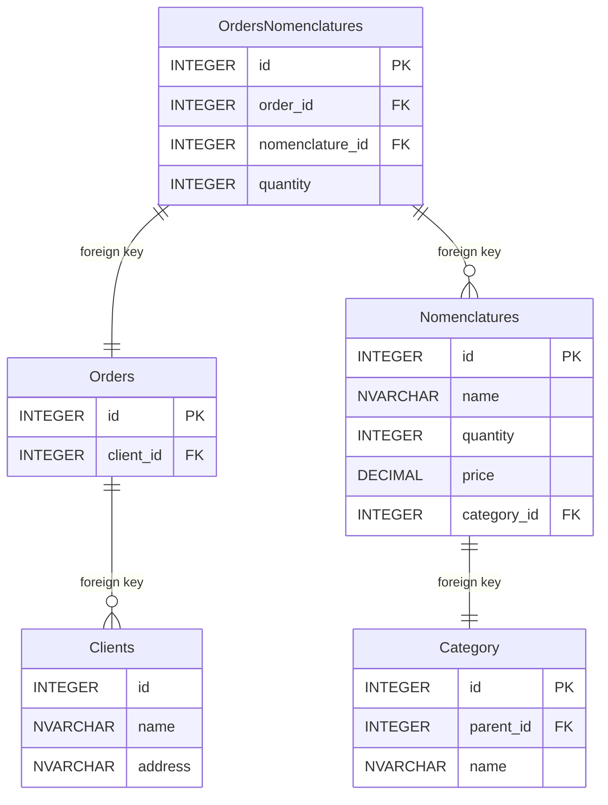

# Проект по проектированию БД и написанию SQL запросов

## Задание
Спроектировать схему БД.
Модель данных реляционная.

Сущности
 1.  Номенклатура (наименование, кол-во, цена)

 2. Каталог номенклатуры/Дерево категорий.
	Необходимо хранить данные о категориях товара, при этом сами категории могут
	иметь неограниченный уровень вложенности
	Пример дерева категорий:
	```
	Бытовая техника
		Стиральные машины
		Холодильники
			однокамерные
			двухкамерные
	Телевизоры
	…
	Компьютеры
		Ноутбуки
			17“
			19“
		...
		Моноблоки
	…
	```

	Схема данных категорий номенклатуры должна безболезненно позволять добавлять
	категории любого уровня вложенности. На этапе проектирования максимальный
	уровень вложенности неизвестен.
 3. Клиенты (наименование, адрес)
 4. Заказы покупателей. Необходимо предусмотреть возможность делать заказ из
разного набора товаров.
Продумать схему БД, бизнес логику описывать не требуется.

 5. Написать следующие SQL запросы:

	 5.1. Получение информации о сумме товаров заказанных под каждого клиента (Наименование клиента, сумма)


	5.2. Найти количество дочерних элементов первого уровня вложенности для
	категорий номенклатуры.

# Схема базы данных





# Запросы 

 1. Получение информации о сумме товаров заказанных под каждого клиента
```sql 
SELECT clients.name, SUM(orders_nomenclatures.quantity * nomenclatures.price)
FROM clients
JOIN orders ON clients.id = orders.client_id
JOIN orders_nomenclatures ON orders.id = orders_nomenclatures.order_id
JOIN nomenclatures ON orders_nomenclatures.nomenclature_id = nomenclatures.id
GROUP BY clients.id
```

2. Найти количество дочерних элементов первого уровня вложенности для
категорий номенклатуры.
```sql 
SELECT c1.name, COUNT(c2.id) AS children_count
FROM categories c1
LEFT JOIN categories c2 ON c2.parent_id = c1.id
GROUP BY c1.id
ORDER BY children_count DESC

```

