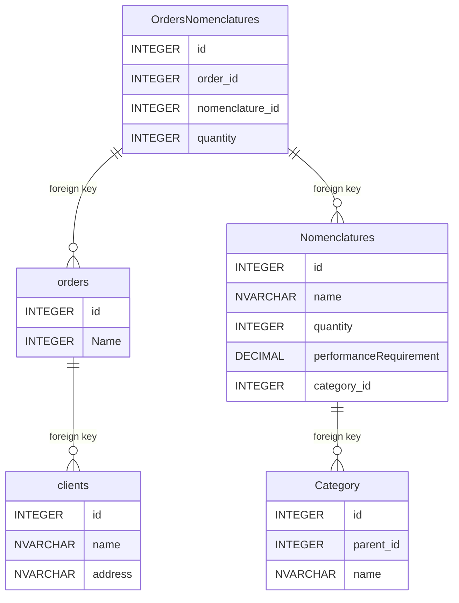

# Проект по проектированию БД и написанию SQL запросов

# Схема базы данных




# Запросы 

 1. Получение информации о сумме товаров заказанных под каждого клиента
```sql 
SELECT clients.name, SUM(orders_nomenclatures.quantity * nomenclatures.price)
FROM clients
JOIN orders ON clients.id = orders.client_id
JOIN orders_nomenclatures ON orders.id = orders_nomenclatures.order_id
JOIN nomenclatures ON orders_nomenclatures.nomenclature_id = nomenclatures.id
GROUP BY clients.id
```

2. Найти количество дочерних элементов первого уровня вложенности для
категорий номенклатуры.
```sql 
SELECT c1.name, COUNT(c2.id) AS children_count
FROM categories c1
LEFT JOIN categories c2 ON c2.parent_id = c1.id
GROUP BY c1.id
ORDER BY children_count DESC

```

